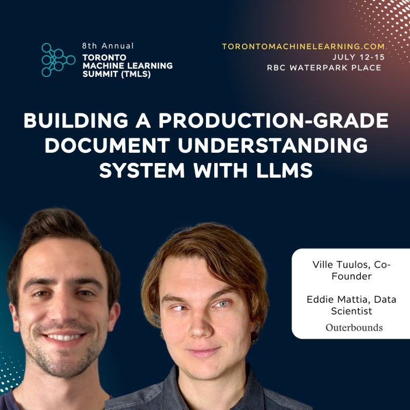

## Building a production-grade document processing workflow with LLMs

## Introduction

This repository shows document processing workflows on Outerbounds. 

## Examples
- [PDF app](pdf-app/README.md): Chat with a PDF, do batch workflows with PDFs, and more.
- [Sentiment review](sentiment-review/README.md): Analyze sentiment of reviews using NVidia NIM.
    - NOTE: to access the `@nim` decorator in the example, you'll need to be running Metaflow on Outerbounds. Alternatively, you can use the regular OpenAI API and remove the `@nim` references.
